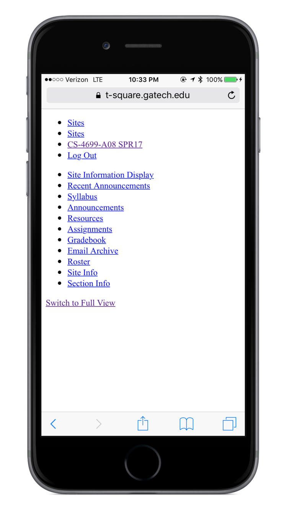
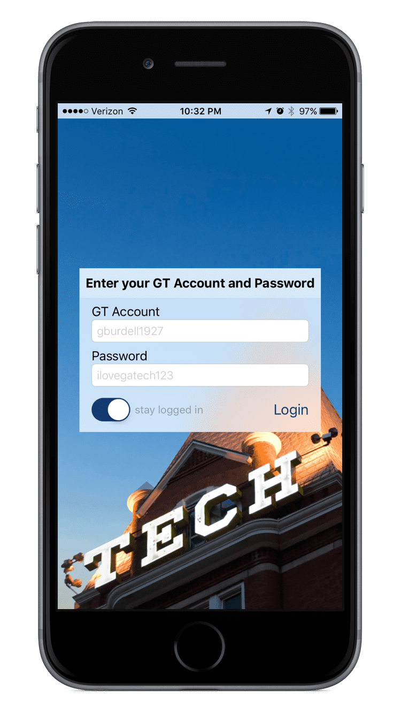

# T-Squared
Georgia Tech uses a system called [T-Square](http://t2.gatech.edu) to distribute  information about classes, assignments, and grades. Its default mobile site (left) is pretty abysmal, so I built T-Squared. It manually authenticates over http, scrapes the mobile site to fetch content, and then renders it in a native UI (right). Since release, T-Squared has been used over 2 million times.

      

